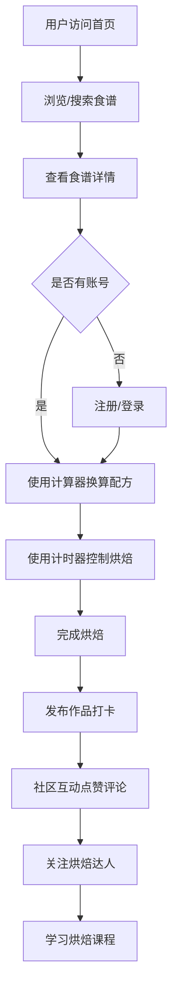

## 1. 产品概述

烘焙食谱分享全栈社区，面向烘焙爱好者提供食谱发布、学习交流、作品打卡、课程学习和工具辅助的一站式平台。

- 核心用户：烘焙新手、资深烘焙达人、烘焙教学者
- 核心价值：降低烘焙门槛，促进社群交流，提供专业工具辅助

## 2. 核心功能

### 2.1 用户角色

| 角色 | 注册方式 | 核心权限 |
|------|----------|----------|
| 普通用户 | 邮箱/用户名注册 | 浏览食谱、发布作品、点赞评论收藏、关注达人、使用工具 |
| 烘焙达人 | 普通用户升级 | 发布食谱、创建课程、获得粉丝 |

### 2.2 功能模块

1. **首页**：分类导航、热门食谱推荐、达人榜单、工具入口
2. **食谱浏览**：分类筛选（面包/蛋糕/饼干/甜点）、难度筛选、耗时筛选、搜索
3. **食谱详情**：成品展示、食材清单（支持人数换算）、步骤卡片（温度/时间标注）、互动区
4. **食谱发布向导**：上传照片→填写食材→编写步骤→设置参数→发布
5. **烘焙计算器**：模具尺寸自动换算配方用量
6. **烘焙计时器**：多任务并行计时、预设温度提醒
7. **作品打卡**：上传作品照、记录心得、关联食谱
8. **社区互动**：点赞、评论、收藏、关注
9. **烘焙课程**：视频列表、章节进度追踪、模拟付费
10. **商城入口**：烘焙材料与工具推荐
11. **个人中心**：我的食谱、作品、收藏、关注、课程进度

### 2.3 页面详情

| 页面名称 | 模块名称 | 功能描述 |
|----------|----------|----------|
| 首页 | 轮播Banner | 展示热门活动和精选食谱 |
| 首页 | 分类导航 | 面包/蛋糕/饼干/甜点快捷入口 |
| 首页 | 热门食谱 | 瀑布流卡片展示高赞食谱 |
| 首页 | 达人推荐 | 展示粉丝最多的烘焙达人 |
| 首页 | 工具入口 | 计算器、计时器快捷入口 |
| 食谱列表 | 筛选栏 | 分类、难度、耗时多维度筛选 |
| 食谱列表 | 食谱卡片 | 封面图、标题、作者、难度、耗时、点赞数 |
| 食谱详情 | 成品展示 | 大图轮播成品照片 |
| 食谱详情 | 食材清单 | 用量列表、人数切换器自动换算 |
| 食谱详情 | 步骤卡片 | 图文卡片形式，标注烘焙温度与时间 |
| 食谱详情 | 互动区 | 点赞、收藏、评论列表、作品墙 |
| 食谱发布 | 步骤向导 | 五步式发布流程 |
| 烘焙计算器 | 换算表单 | 原配方、原模具、目标模具、自动计算 |
| 烘焙计时器 | 多任务面板 | 并行多个计时任务、温度预设提醒 |
| 作品发布 | 打卡表单 | 上传照片、关联食谱、心得记录 |
| 课程中心 | 课程列表 | 课程封面、标题、章节数、价格 |
| 课程详情 | 章节播放 | 视频播放、章节列表、学习进度 |
| 个人中心 | 数据面板 | 发布数、获赞数、粉丝数、关注数 |
| 个人中心 | 内容管理 | 我的食谱、作品、收藏、关注列表 |

## 3. 核心流程

用户打开首页 → 浏览或搜索食谱 → 查看食谱详情 → 按食谱制作 → 使用计算器和计时器辅助 → 完成后发布作品打卡 → 获得社区点赞评论 → 关注达人学习更多

## 4. 用户界面设计

### 4.1 设计风格

- **主色调**：暖焦糖色 `#D2691E` 搭配奶油米白 `#FFF8E7`，营造烘焙温暖氛围
- **辅助色**：小麦金 `#F4A460`、可可棕 `#8B4513`、抹茶绿 `#8FBC8F`
- **按钮风格**：圆角大按钮，悬停时有微上浮阴影
- **字体**：标题使用「思源宋体」体现精致感，正文使用「思源黑体」保障可读性
- **布局风格**：卡片式布局，大量留白，温暖舒适
- **图标风格**：圆润线条烘焙相关图标（面包、蛋糕、搅拌器、温度计等）

### 4.2 页面设计概览

| 页面名称 | 模块名称 | UI 元素 |
|----------|----------|----------|
| 首页 | Banner | 大图轮播、渐变遮罩、文字上浮动画 |
| 首页 | 分类卡片 | 圆角图标卡、hover 放大效果、暖色渐变背景 |
| 首页 | 食谱瀑布流 | 交错卡片布局、图片懒加载、hover 显示作者信息 |
| 食谱详情 | 食材清单 | 数字步进器切换人数、用量数字滚动动画 |
| 食谱详情 | 步骤卡片 | 时间轴布局、温度徽章、时间徽章、进度指示器 |
| 计时器 | 任务卡片 | 圆环倒计时动画、温度颜色编码、完成提醒动效 |
| 个人中心 | 数据面板 | 数字翻牌动画、渐变数据条、头像圆框 |

### 4.3 响应式

- 桌面端优先设计（1280px+）
- 平板端（768-1024px）：两列布局调整为单列
- 移动端（<768px）：单列紧凑布局，底部 Tab 导航

### 4.4 动效设计

- 页面加载：卡片交错淡入（staggered fade-in）
- 悬停交互：微上浮 + 阴影加深 + 轻微缩放
- 计时器：圆环进度 SVG 动画
- 数字变化：滚动过渡动画
- 点赞/收藏：心形弹跳动画
