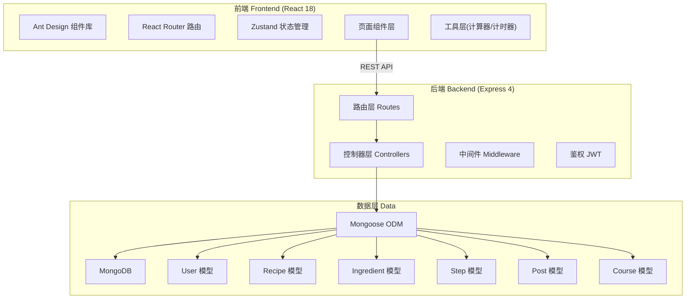
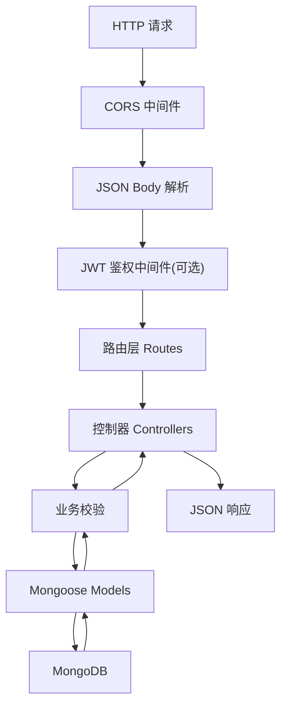
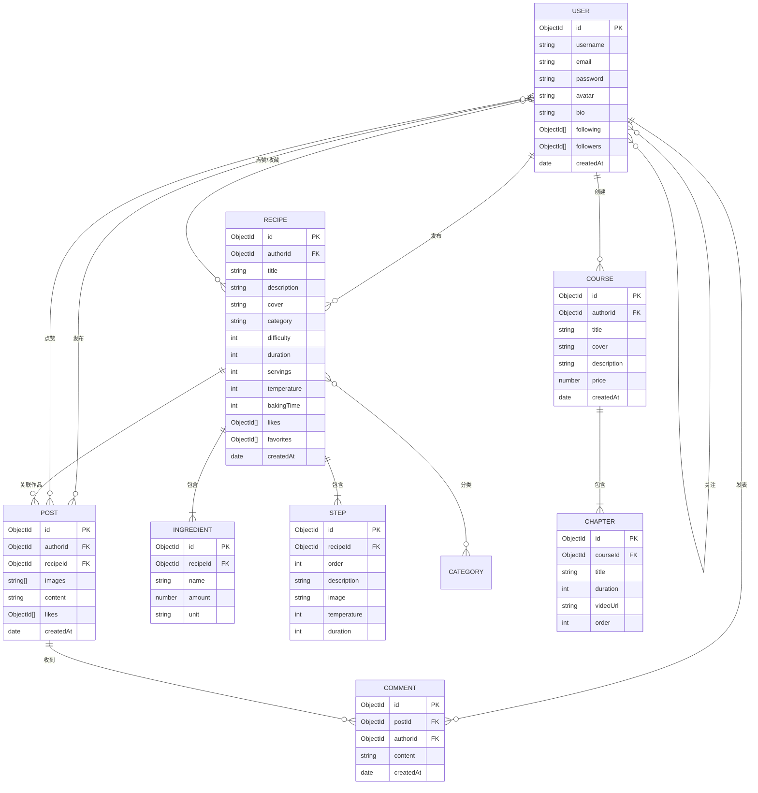

## 1. 架构设计



## 2. 技术说明

- **前端**：React 18 + TypeScript + Vite + Ant Design 5 + Zustand + React Router 6
- **后端**：Express 4 + TypeScript + Mongoose 7 + JWT + bcryptjs + cors
- **数据库**：MongoDB（本地或 MongoDB Memory Server 用于开发演示）
- **初始化工具**：Vite (react-express-ts 模板)

## 3. 路由定义

### 前端路由

| 路由 | 页面 | 用途 |
|------|------|------|
| `/` | Home | 首页，展示推荐内容 |
| `/recipes` | RecipeList | 食谱列表页 |
| `/recipes/:id` | RecipeDetail | 食谱详情页 |
| `/recipes/publish` | RecipePublish | 食谱发布向导 |
| `/calculator` | Calculator | 烘焙计算器 |
| `/timer` | Timer | 烘焙计时器 |
| `/posts` | PostList | 作品打卡列表 |
| `/posts/publish` | PostPublish | 发布作品打卡 |
| `/courses` | CourseList | 烘焙课程列表 |
| `/courses/:id` | CourseDetail | 课程详情与播放 |
| `/shop` | Shop | 商城推荐入口 |
| `/profile` | Profile | 个人中心 |
| `/login` | Login | 登录页 |
| `/register` | Register | 注册页 |

## 4. API 定义

### 4.1 认证接口

```typescript
// POST /api/auth/register
interface RegisterReq { username: string; email: string; password: string; }
interface AuthRes { token: string; user: UserDto; }

// POST /api/auth/login
interface LoginReq { email: string; password: string; }
interface AuthRes { token: string; user: UserDto; }
```

### 4.2 用户接口

```typescript
// GET /api/users/:id
interface UserDto {
  id: string; username: string; email: string; avatar: string;
  bio: string; followersCount: number; followingCount: number;
  recipesCount: number; postsCount: number;
}

// GET /api/users/:id/followers
// GET /api/users/:id/following
// POST /api/users/:id/follow
// DELETE /api/users/:id/follow
```

### 4.3 食谱接口

```typescript
// GET /api/recipes?category=&difficulty=&time=&page=&limit=
interface RecipeListRes {
  list: RecipeSummary[]; total: number; page: number;
}
interface RecipeSummary {
  id: string; title: string; cover: string;
  category: 'bread' | 'cake' | 'cookie' | 'dessert';
  difficulty: 1 | 2 | 3 | 4 | 5;
  duration: number; // 分钟
  author: UserDto;
  likesCount: number;
}

// GET /api/recipes/:id
interface RecipeDetail extends RecipeSummary {
  description: string;
  servings: number;
  ingredients: Ingredient[];
  steps: Step[];
  temperature: number;
  bakingTime: number;
  createdAt: string;
  isLiked: boolean;
  isFavorited: boolean;
}

// POST /api/recipes
interface CreateRecipeReq {
  title: string; description: string; cover: string;
  category: string; difficulty: number; duration: number;
  servings: number; temperature: number; bakingTime: number;
  ingredients: IngredientInput[];
  steps: StepInput[];
}

// POST /api/recipes/:id/like
// DELETE /api/recipes/:id/like
// POST /api/recipes/:id/favorite
// DELETE /api/recipes/:id/favorite
```

### 4.4 作品打卡接口

```typescript
// GET /api/posts?recipeId=&userId=&page=&limit=
interface PostDto {
  id: string;
  images: string[];
  content: string;
  recipe?: RecipeSummary;
  author: UserDto;
  likesCount: number;
  commentsCount: number;
  createdAt: string;
}

// POST /api/posts
interface CreatePostReq {
  images: string[]; content: string; recipeId?: string;
}

// POST /api/posts/:id/comments
interface CreateCommentReq { content: string; }
interface CommentDto {
  id: string; content: string; author: UserDto; createdAt: string;
}
```

### 4.5 课程接口

```typescript
// GET /api/courses
interface CourseDto {
  id: string; title: string; cover: string;
  description: string; chapters: ChapterDto[];
  price: number; author: UserDto;
  progress?: number; // 0-100
}
interface ChapterDto {
  id: string; title: string; duration: number; videoUrl: string;
}

// POST /api/courses/:id/progress
interface UpdateProgressReq { chapterId: string; completed: boolean; }
```

## 5. 服务端架构图



## 6. 数据模型

### 6.1 ER 图



### 6.2 项目结构

```
71/
├── .trae/documents/
│   ├── PRD.md
│   └── TECHNICAL_ARCHITECTURE.md
├── src/                          # 前端源码
│   ├── components/               # 通用组件
│   │   ├── Layout/
│   │   ├── RecipeCard/
│   │   ├── IngredientList/
│   │   ├── StepCard/
│   │   ├── Timer/
│   │   └── Calculator/
│   ├── pages/                    # 页面组件
│   │   ├── Home/
│   │   ├── RecipeList/
│   │   ├── RecipeDetail/
│   │   ├── RecipePublish/
│   │   ├── Calculator/
│   │   ├── Timer/
│   │   ├── PostList/
│   │   ├── PostPublish/
│   │   ├── CourseList/
│   │   ├── CourseDetail/
│   │   ├── Shop/
│   │   ├── Profile/
│   │   ├── Login/
│   │   └── Register/
│   ├── store/                    # Zustand 状态
│   ├── api/                      # 前端 API 封装
│   ├── hooks/                    # 自定义 Hooks
│   ├── utils/                    # 工具函数
│   ├── types/                    # 类型定义
│   ├── App.tsx
│   ├── main.tsx
│   └── index.css
├── api/                          # 后端源码
│   ├── config/                   # 配置
│   ├── models/                   # Mongoose 模型
│   │   ├── User.ts
│   │   ├── Recipe.ts
│   │   ├── Ingredient.ts
│   │   ├── Step.ts
│   │   ├── Post.ts
│   │   ├── Comment.ts
│   │   └── Course.ts
│   ├── routes/                   # 路由
│   ├── controllers/              # 控制器
│   ├── middleware/               # 中间件
│   ├── utils/                    # 工具函数
│   ├── seed/                     # 种子数据
│   └── index.ts                  # 入口
├── shared/                       # 共享类型
├── package.json
├── vite.config.ts
├── tsconfig.json
└── tailwind.config.js
```
